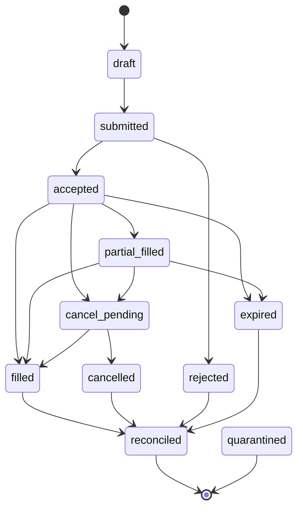

# Order State Machine (XAR-481)

L3 plant observer for live trading. Wraps the per-adapter reconciliation
modules (`backend/app/trading/adapters/{qmt,crypto}/reconciliation.py`) in a
formal 11-state lifecycle backed by an append-only SQLite event log.

Implementation: `backend/app/trading/state_machine.py`
Tests: `backend/tests/trading/test_state_machine.py`

## Why a state machine, not a JSONL log

`recon_state.py` was sufficient for paper-mode reconciliation -- 5 states,
flat status transitions, JSONL append. Live trading needs:

- Distinct states for the cancel race (`cancel_pending -> filled` vs
  `cancel_pending -> cancelled`)
- Distinct `partial_filled` so we can reason about working-quantity exposure
- A formal `accepted` state separate from `filled` (broker ack != execution)
- A persistence layer that A3 pretrade and A4 kill switch can query under
  cross-process load (SQLite WAL handles this; JSONL replay does not)

The legacy JSONL module stays in place -- the two coexist. Crypto paper and
existing QMT sim tests are not affected.

## States

| State              | Terminal | Meaning                                               |
| ------------------ | -------- | ----------------------------------------------------- |
| `draft`            | no       | Registered locally, not yet sent                      |
| `submitted`        | no       | Sent to broker, awaiting ack                          |
| `accepted`         | no       | Broker accepted, working in market                    |
| `rejected`         | no       | Broker rejected (pre-fill)                            |
| `partial_filled`   | no       | Some quantity filled, rest still working              |
| `filled`           | no       | Fully filled, awaiting reconcile against positions    |
| `cancel_pending`   | no       | Cancel request sent, awaiting confirm or fill race    |
| `cancelled`        | no       | Cancel confirmed by broker                            |
| `expired`          | no       | Order TIF lapsed without full fill                    |
| `reconciled`       | **yes**  | Position + cash match expectation -- archival         |
| `quarantined`      | **yes**  | FDI-flagged: stuck non-terminal > 60s -- needs human  |

"Non-terminal" states with no further activity are FDI-flagged by
`ReconciliationStateMachine.tick()` and force-moved to `quarantined`.

## Mermaid



Quarantine edges are not drawn -- any non-terminal state can transition to
`quarantined` via `tick()` when stale (`stale_after_ns`, default 60s).

## Transitions table (single source of truth)

The test `test_transitions_contain_every_handoff_arrow` asserts that the
table below matches the `_TRANSITIONS` dict in code exactly.

```
draft           --> submitted        # submit
submitted       --> accepted         # broker_accept
submitted       --> rejected         # broker_reject
accepted        --> partial_filled   # partial_fill
accepted        --> filled           # full_fill
accepted        --> cancel_pending   # cancel_request
accepted        --> expired          # expire
partial_filled  --> filled           # full_fill
partial_filled  --> cancel_pending   # cancel_request
partial_filled  --> expired          # expire
cancel_pending  --> cancelled        # cancel_confirm
cancel_pending  --> filled           # cancel_race_filled
filled          --> reconciled       # reconcile
cancelled       --> reconciled       # reconcile
rejected        --> reconciled       # reconcile
expired         --> reconciled       # reconcile
```

## Cancel race semantics

`cancel_pending` exists precisely to model the broker race window. Two outcomes
are legal from `cancel_pending`:

- `cancel_pending -> cancelled` -- broker acknowledged the cancel cleanly
- `cancel_pending -> filled` -- broker had already filled (fully) before our
  cancel reached the matching engine; the fill wins, the cancel is a no-op

Both must be handled by callers. Tests
`test_cancel_race_clean_cancel_confirm` and
`test_cancel_race_broker_fills_before_cancel` cover both branches.

A `partial_filled -> cancel_pending -> filled` chain is also legal -- the
filled state is reached once the remaining quantity completes, even if a
cancel request was in flight.

## Persistence

SQLite at `data/orders.db`, WAL mode, single-writer pattern (one
`ReconciliationStateMachine` instance per process).

```sql
CREATE TABLE order_events (
    id INTEGER PRIMARY KEY AUTOINCREMENT,
    order_id TEXT NOT NULL,
    ts INTEGER NOT NULL,         -- UTC nanoseconds, time.time_ns()
    from_state TEXT NOT NULL,
    to_state TEXT NOT NULL,
    payload_json TEXT NOT NULL DEFAULT '{}',
    source TEXT NOT NULL DEFAULT ''
);
CREATE INDEX idx_order_events_order_id ON order_events(order_id);
CREATE INDEX idx_order_events_ts ON order_events(ts);
```

Snapshot recovery: on init, the machine replays all rows ordered by `id` and
rebuilds `order_id -> (current_state, last_event_ts)` in memory. No checkpoint
file -- the event log is the authoritative store.

WAL + `synchronous=NORMAL` + single-row inserts keep append latency well
under the 10 ms / op budget set in the FSC handoff.

## FDI: `tick()`

Called periodically by the trading loop (recommended 1 Hz). For each
non-terminal order whose `last_event_ts` is older than `stale_after_ns`
(default 60 s = 60 * 1e9 ns):

1. Append a `current_state -> quarantined` event with payload
   `{"stale_for_ns": ..., "stale_after_ns": ...}`
2. Update snapshot to `quarantined`
3. Return the emitted events so A6 alert router can route them as critical

Once an order is quarantined it is terminal -- further `submit()` calls raise
`IllegalTransition`. Recovery is human-driven (operator must reconcile and
mark a follow-up order; the original stays in the event log forever).

## Coupling

- **A3 pretrade** reads `state(order_id)` and `last_ts(order_id)` to decide
  whether to allow a new submission for the same instrument
- **A4 kill switch** subscribes to `tick()` quarantine events and to any
  `accepted -> cancel_pending` transition originating from `source="kill_switch"`
- **A5 heartbeat** uses `tick()` cadence as the order-loop health signal
- **A6 alert router** receives quarantine events at `critical` severity

## Non-goals

- Multi-process write coordination: SQLite WAL allows multi-process reads
  but our writer is single-process by design. If we ever fork the broker
  bridge into its own process, this module needs a write-coordination layer.
- Migration to a heavier engine: while+if is enough. We deliberately reject
  `python-statemachine` / `transitions` (handoff explicit ban).
- `datetime` timestamps: int ns only, everywhere. Tooling that wants a string
  formats from int at the edge.
